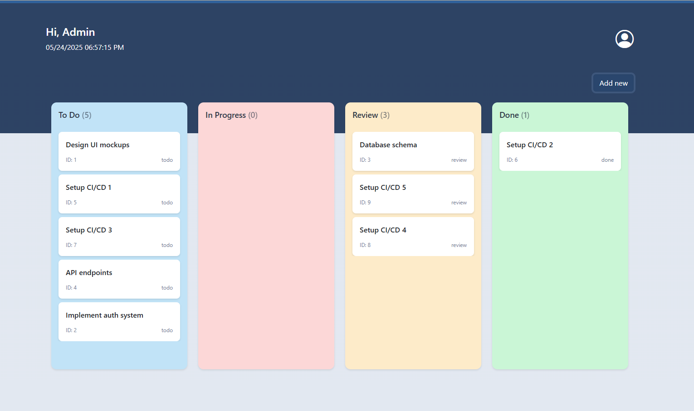

# TASK MONITORING APP

## Description
A lightweight Task Monitoring Board web application for task management, inspired by the Kanban methodology. This project allows users to create, organize, and track tasks across customizable columns (e.g., To Do, In Progress, Done).

### Key Features:
- ✔ Drag-and-drop task movement between columns
- ✔ Add/Edit/Delete tasks
- ✔ Clean UI with customizable task cards

This project focuses on simplicity and usability. Ideal for personal productivity.

## Technologies
- Node.js
- Express.js
- Electron
- React
- Typescript
- PostgreSQL

### Frameworks
- DND
- Swagger
- Redux/Toolkit
- Bootstrap

## Installation 

Create file `.env` in main folder
Fill the files with the following variables

```
POSTGRES_DB=your-db-name
POSTGRES_USER=your-db-root
POSTGRES_PASSWORD=your-pass
POSTGRES_PORT=your-db-port-number
APP_PORT_HOST=port-number
```

Build the app with following command
`docker-compose up --build`
## Uninstallation
Uninstall the app with the command
`docker-compose down`

## Run App
Below is a command for running the app
`docker-compose up`

### Work with the app through a Browser 
The port-number you set in `.env` file, please use it for below URL:
`http://localhost:${port-number}`


### Run Desktop APP
It is required to run the docker app first.
- Open folder electron-app
`cd electron-app`
- Install npm modules
`npm install`
#### Run App by Mode
- Dev Mode
```bash
$ npm run dev
```
- Build

```bash
# For windows
$ npm run build:win

# For macOS
$ npm run build:mac

# For Linux
$ npm run build:linux
```

## Project documentation 
The server is included swagger documentation
`http://localhost:${server-port-number}/docs`




